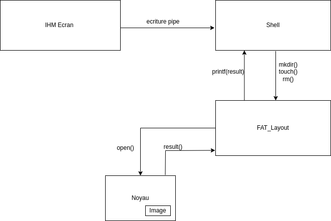

- [Introduction](#introduction)
- [Pré-requis](#pré-requis)
- [Diagramme de communication](#diagramme-de-communication)
- [Explication brève FAT32](#explication-brève-fat32)
- [Utilisation](#utilisation)
- [Bibliographie](#bibliographie)

## Introduction

Ce projet est réalisé dans le cadre du cours NSY103, où il s'agirait d'implémenter un système de gestion de fichiers FAT32 qui permettrait de lire le disque.

## Pré-requis

Pour le bon fonctionnement du programme il est nécessaire d'avoir **un image disk** que l'on créera avec un Makefile formater sour format Fat32. 
Etre sous un environnement linux est aussi primordiale car certaines commandes du Make ne s'execute que sur un système Unix. 
Pour des démos et pouvoir débugger, il est aussi nécessaire d'avoir l'utilitaire **mtools** sur Linux pour voir le contenu du disque. 
Pour débugger, vous pourrez aussi utilisez **hexedit** ou **okteta**


## Diagramme de communication




## Explication brève FAT32

FAT est un système de gestion de fichiers développés par Microsoft principalement utilisés pour les petits disque (floppy disk et les cartes SD). \
Il a connu des évolutions au fil des années notamment sur la taille des fichiers qu'elle peut supporter. \
FAT de son abbréviation utilise une File Allocation Table qui pour garder en mémoire les clusters composés de secteurs de où sont associés les fichiers. \
Le nombre associés à chaque Fat correspond au nombre de bits pour entrées  dans la table.


Un système de fichier FAT doit au moins contenir ces 4 sections pour pouvoir lire un fichier dans le dique.

* BootSector : Se situe au début du disque et contient les informations necessaires pour le système de fichier  (exemple: les informations de format, le nombre de secteur par cluster etc ..)
* RootDirectory : Se situe après le booSector et contient les informations contenant le fichier recherché tel que le nom du fichier, son volume et le pointeur d'adresse qui contient l'adresse du premier clusster ou se situe le contenu du fichier. \
  Elle n'existe pas sur les FAT32 et la valeur en Bits est toujours égale à 0. 
* FAT table region : Une table d'entrée de cluster qui référence l'adresse du pointeur suivant ou se situe le contenu d'un fichier. 
* Data Region : partition où se situe les données. 

## Utilisation 
Pour lancer le code, il faudrait d'abord lancer ces commandes qui créront un disque  image en formater en FAT32.\

1. ```sudo fdisk -l ``` \
Identifier le disque avec le plus d'espace (ex: /dev/sda1)

2. ```sudo dd if=/dev/sda1 of=disk.img bs=1M count1024``` \
Ceci créera un disque image binaire avec de blocs de 1M et une taille de 1 Gigaoctet.

3. ```sudo mkfs.vfat -F 32 disk.img``` \
Ceci va formater le disque en FAT32, mais il ne crée pas les partitions. 
Notre disque aura alors : 
- le BOOTSECTOR
- le FAT Region 
- le DATA Region 

Maintenant nous allons pouvoir lancer la compilation avec gcc \

```gcc -o noyau fat32-code.c```

Pour executer : \

! Remarques: Les fichiers et repertoire doivent etre en majuscule sinon il y aurait des erreurs. \


```
./noyau <disk.img>

ls command
prompt:/>ls 

mkdir command
prompt:/>mkdir TOTO

cd command
prompt:/>cd TOTO 

touch command
prompt:TOTO> touch TATA.TXT

Pour écrire dans un fichier il faut d'abord ouvrir en ecriture puis le fermer 

prompt:TOTO>fopen TATA.TXT w 
prompt:TOTO>fread TATA.TXT "Helloo world , my name is TOTO"
prompt:TOTO>fclose TATA.TXT 

Pour la lecture il faut réouvrir et mettre le flag en read et puis le fermer

prompt:TOTO>fopen TATA.TXT r
prompt:TOTO>fread TATA.TXT 0 16 #read the 16 first bytes.
prompt:TOTO>fclose TATA.TXT

Pour lister le fichier créer: 
prompt:TOTO>ls

Pour le supprimer: 
prompt:TOTO>rm TATA.TXT

```

## Bibliographie

[FAT32-Project](https://www.cs.fsu.edu/~cop4610t/lectures/project3/Week11/Slides_week11.pdf)

[FAT32-Microsoft-PDF](http://www.osdever.net./documents/fatgen103.pdf)


